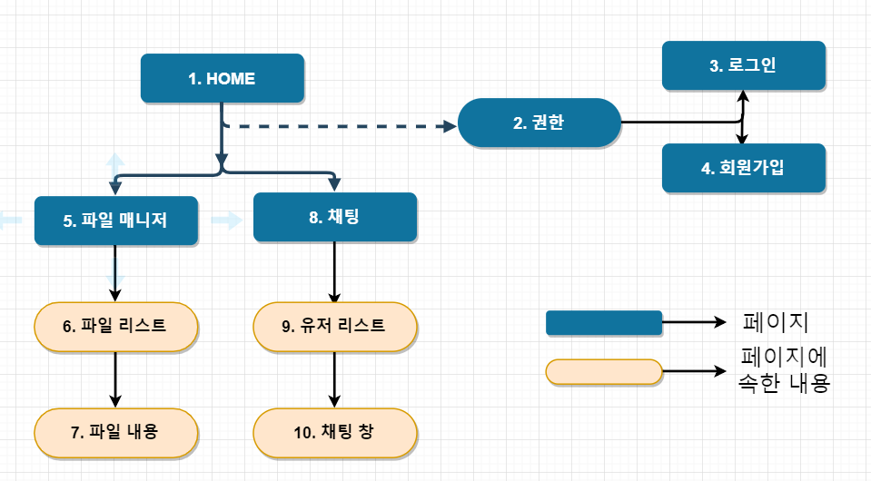

# 프로젝트 주요 스펙

- Front-end : React + Bootstrap + Reactstrap + React-router
- Back-end : Node.js + Socket.io + MongoDB + Redis

# 실행 방법

**몽고 레디스 백그라운드 실행**

```
./start.sh
```

**클라이언트**

### step1

```
client/src/config.js 에서
export const SERVER_IP = 'http://localhost:4000'; 를 자신의 서버 아이피와 포트로 설정.

client/src/setupProxy.js 에서
app.use(proxy('/api', { target: 'http://localhost:4000/' }));의 target을 자신의 서버 아이피와 포트로 설정.
```

### step2

```
cd client
npm install
npm start
```

**서버**

```
cd server
npm install
npm start
```

# [Front-end]

## 1. 페이지 구성도



**(1) Home** : 첫 페이지

**(2) 권한** : 중복로그인 방지 기능

- 동일한 계정으로 로그인 시 동일 계정 접속 Alert 출력 및
  (접속한 계정, 접속해있던 계정)로그아웃 처리.
- 세션 만료시 로그아웃 처리.

**(3) 로그인** : 페이지에 로그인 할 수 있는 페이지

- ID/PW 모두 입력하지 않았을 경우 : 모두 입력해주세요 Alert 출력
- ID 틀렸을 경우 : 없는 아이디입니다. Alert 출력.
- PW 틀렸을 경우 : 패스워드가 틀립니다. Alert 출력.
- ID/PW 맞았을 경우 : 로그인 처리.

**(4) 회원가입** : 회원가입을 할 수 있는 페이지

- 모두 입력하지 않았을 경우 : 모두 입력해주세요 Alert 출력.
- 아이디 혹은 이메일이 중복된 경우 : 중복된 아이디 혹은 이메일입니다. Alert 출력.
- PW와 PW확인이 다를 경우 : PW가 다릅니다. Alert 출력.

**(5) 파일 매니저** : 파일을 관리할 수 있는 페이지

> **(6)파일 리스트** : 파일을 업로드하고 ul, li로 출력하는 컴포넌트
>
> - tar.. zip 파일만 선택 할 수 있는 기능.
> - 압축 폴더 이름 중복 검사 후 업로드 여부 파악.
> - 페이지 업로드 상황을 Progress Bar로 출력.
> - ul, li를 이용하여 디렉토리구조 출력.
> - 폴더를 클릭했을 경우 하위 디렉토리 출력.
> - 파일을 클릭했을 경우 해당 파일 내용을 불러옴.

> **(7) 파일 내용** : 파일을 수정할 수 있는 컴포넌트
>
> - 파일리스트(5)에서 클릭한 파일에 내용을 출력.
> - 파일에 내용을 수정 후 저장버튼 클릭시 해당 내용 저장.

**(8) 채팅** : 실시간으로 접속한 유저들과 채팅할 수 있는 페이지.

> **(9) 유저 리스트** : 접속한 유저를 출력하는 컴포넌트.
>
> - 접속한 유저 출력
> - 리스트 클릭시 해당 사용자와 대화(귓속말) 가능

> **(10) 채팅 창** : 전체 채팅 및 귓속말 채팅을 보낼 수 있는 컴포넌트
>
> - 유저리스트에서 [전체] 클릭시 전체 채팅 및 이전 대화내용 출력
> - 유저리스트에서 [ID] 클릭시 귓속말 채팅 및 이전 대화내용 출력

> **[추가기능]** : 메시지 알림 기능
>
> - 예) A사용자가 접속한 B사용자에게 귓속말 채팅 시 B사용자가 채팅 페이지에 없다면 B사용자 웹페이지에 메시지 알림 출력

# [Back-end]

## 2. 기능 구현

**(1) 회원가입, 로그인, 로그아웃 기능**

**사용한 모듈**

- passport, passport-local : 회원가입, 로그인,, 로그아웃 세션 관리를 쉽게 해주기 위한 모듈.
- bcrypt-nodejs : 비밀번호를 암호화 복호화 하기위한 모듈.
- express-session : passport 모듈과 같이 사용하여 세션을 저장하기위한 모듈.
- connect-redis : 서버가 꺼지면 없어지는 express-session과 같이 사용하여 세션을 저장하기위한 모듈.

**(2) 파일 매니저 기능**

**사용한 모듈**

- multer : 파일을 업로드하기위해 사용하는 모듈.
- tar-fs, unzip : tar, zip파일을 각각 압축해제하기위해 사용하는 모듈.
- directory-tree : 해당 경로에 속한 모든 서브디렉토리와 파일들의 데이터를 tree구조로 구조화 하기위해 사용하는 모듈.

**(3) 채팅 기능**

**사용한 모듈**

- socket.io : 실시간 양방향 통신을 하기위해 사용하는 모듈.

## 3. 스키마 (옵션은 생략)

**(1) 유저(회원정보) 모델**

> username - 회원 ID  
> password - 회원 Password (해시화하여 저장)  
> email - 회원 Email  
> files - 회원이 업로드한 파일 \_id (mongoose.schema.Types.ObjectId) 배열  
> sex - 회원 성별  
> createdDate - 회원가입 시간  
> currentDate - 최근 접속 시간

**(2) 업로드한 파일 모델**

> filename, - 파일의 이름  
> path - 저장된 파일의 경로  
> createdDate - 업로드된 시간  
> originalName - 압축파일의 원본 이름
> size - 파일의 크기

**(3) 채팅 참여자 모델**

> username - 접속한 유저의 아이디  
> socketId - 접속한 유저의 소켓 아이디  
> userId - 유저 모델의 \_id (유저 모델을 참조하고 있음.)  
> accessTime - 접속한 시간

**(4) 전체 채팅 내역 모델**

> sender - 보낸 유저 \_id (유저모델을 참조하고 있음)  
> username - 보낸 유저의 아이디  
> message - 메시지 내용  
> createdDate - 메시지를 보낸 시간

**(5) 귓속말 채팅 내역 모델**

> sender - 보낸 유저 \_id (유저 모델을 참조하고 있음)  
> username - 보낸 유저의 아이디  
> message - 메시지 내용  
> receiver - 받는 유저 \_id (유저 모델을 참조하고 있음)  
> receiverName - 받는 유저의 아이디  
> createdDate - 메시지를 보낸 시간
